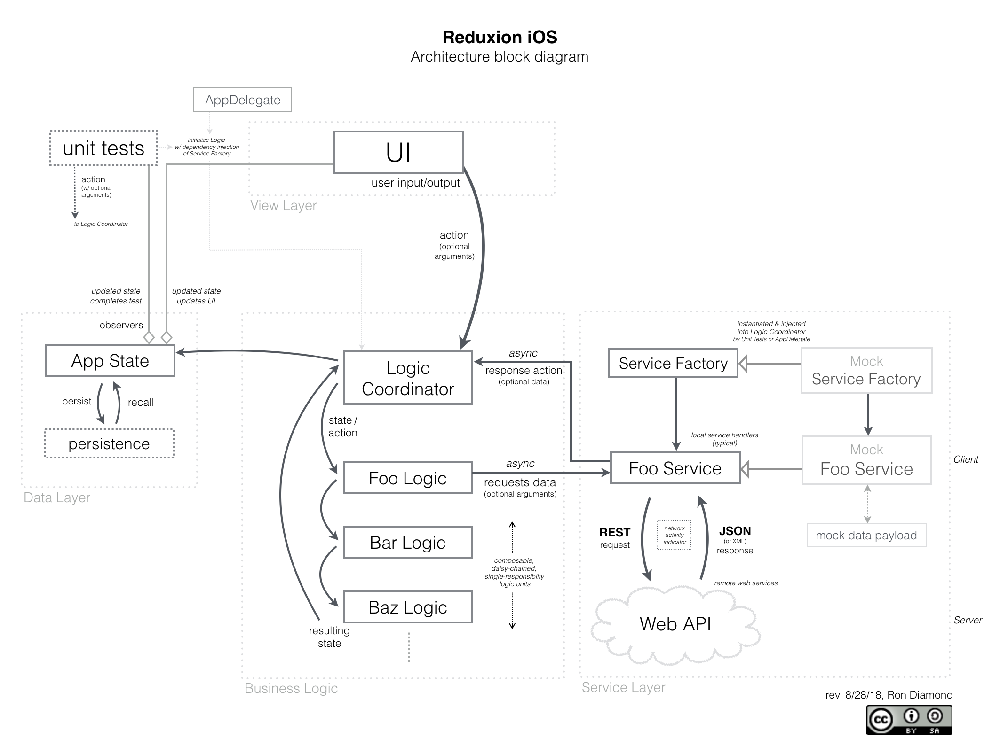

# Reduxion-iOS

*Source code soon to come!*  
   
--   
  
### TL;DR
Easy-to-implement, best-practice Unidirectional Data Flow for iOS apps, featuring:  
- Loosely-coupled layers for View / Business Logic / Services / Data
- Composable business logic, in single-responsibility units
- Good separation of concerns facilitating unit testing (TDD/BDD)
- Ability to switch entire application from real to mock services using one line of code
- Ability to easily persist & recall the entire state of the application
- Ability to easily add time travel (rewind/fast-forward) between different states of the application

~

### Essential Architectural Overview  
A few resources essential to understanding the underlying design patterns:

[***The Principles of Clean Architecture***](https://www.youtube.com/watch?v=o_TH-Y78tt4&t=10m45s) - Robert Martin  
Superb overview of clean architectural design principles [1 hour].  **Highly recommended**.

[***Unidirectional Data Flow in Swift***](https://realm.io/news/benji-encz-unidirectional-data-flow-swift/) - Benjamin Encz  
Video explaining the unidirectional data flow design pattern and its advantages in depth [31+ minutes].

[***Redux for iOS***](http://blog.jtribe.com.au/redux-for-ios/) - Armin Kroll  
Good, concise overview of one available library which has been modified for use in this project.

~

### Block Diagram

~

### Future milestones
- Framework, with sample app
- Carthage support
- Formatter classes (for displayed data)
- ... more

~
### Special Thanks
- [Armin Kroll](https://twitter.com/persival)
- [Benjamin Encz](https://twitter.com/benjaminencz)
- ["Uncle Bob" Martin](https://twitter.com/unclebobmartin)
- ... and everyone else who's been an inspiration toward *Clean Code*.  Thanks.

Author:  
[Ron Diamond](https://twitter.com/ron_diamond)  
